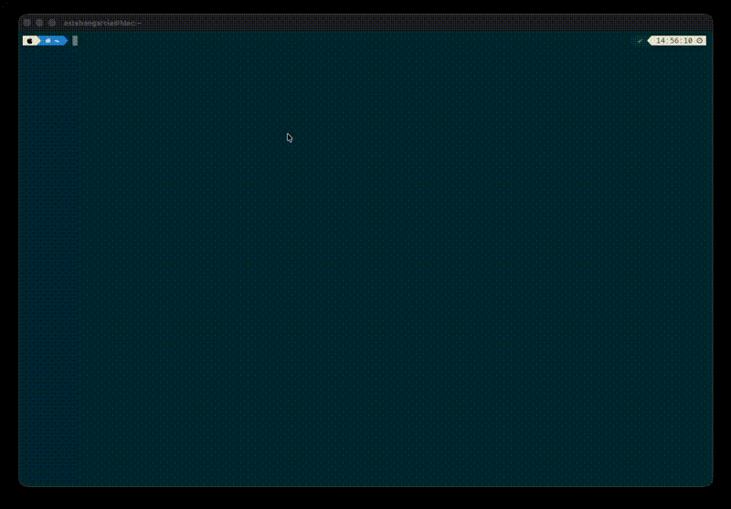

# Tonn

**The AI-first terminal emulator.**



*Tonn* means *wave* in Irish. We're living through a new era of AI-driven development — Tonn helps developers ride this wave in the most effective way possible.

Today's AI coding tools are powerful, but they're blind to your terminal. They can't see what commands you ran, what the output was, or what's happening in your shell. Tonn changes that. It's a GPU-accelerated terminal emulator with a built-in [Model Context Protocol](https://modelcontextprotocol.io/) (MCP) server that gives AI tools like Claude Code, opencode, and gemini-cli deep, structured access to your terminal — no copy-pasting, no screenshots, no context lost.

## How it works

When you launch Tonn, it starts an MCP server in the background and auto-registers it with your AI coding tools. From that point on, your AI assistant can:

- **See what you've been doing** — query recent command outputs without re-running them
- **Search your terminal history** — regex search across all command outputs
- **Run commands directly** — execute shell commands and get structured stdout/stderr back
- **Understand context** — read your working directory, active panes, and last exit code
- **Browse AI sessions** — list and inspect Claude Code sessions across all your projects

The AI doesn't get raw terminal noise. Tonn classifies every command output (git diff, test results, compiler errors, logs, JSON, etc.) and compresses it with domain-specific strategies — typically 90-99% token reduction. Your AI assistant gets the signal, not the noise.

## Features

### Terminal
- GPU-accelerated rendering via wgpu
- Mostly full VT emulation
- Tabs, splits, pane zoom
- 12 built-in themes (dark, dracula, nord, catppuccin, gruvbox, tokyo-night, and more)
- Configurable font, font size, scrollback
- Shell integration for zsh, bash, and fish (auto-injected, zero config)
- Copy/paste, visual bell, window title tracking
- Settings panel with live preview

### AI Integration
- **Built-in MCP server** — auto-registers with Claude Code on launch, deregisters on quit
- **8 MCP tools**: `get_recent_blocks`, `get_block`, `search_blocks`, `get_context`, `list_panes`, `execute`, `list_sessions`, `get_session`
- **Command block model** — every command and its output is captured as a structured block via OSC 133 shell integration
- **Output classification** — 11 output types: git diff, git log, git status, test results, compiler output, logs, directory listings, JSON, grep results, error messages, interactive
- **Token-saving compression** — domain-specific compressors reduce output by 90-99% before sending to AI
- **Three detail tiers** — AI can request summary (one line), classified (key lines), or raw (full output)
- **AI session browser** — tree view of Claude Code sessions with branch awareness, session resume, project grouping
- **Provider pattern** — pluggable architecture for adding new AI tool integrations

### Multiplexer
- Tabs with keyboard switching
- Vertical and horizontal splits
- Tab switcher overlay
- Per-pane PTY isolation
- Pane zoom (toggle fullscreen for any pane)

## Keyboard shortcuts (macOS)

| Shortcut | Action |
|---|---|
| Cmd+T | New tab |
| Cmd+W | Close pane/tab |
| Cmd+D | Vertical split |
| Cmd+Shift+D | Horizontal split |
| Cmd+Shift+Enter | Toggle pane zoom |
| Cmd+]/[ | Cycle pane focus |
| Cmd+1-9 | Switch to tab |
| Ctrl+Tab | Tab switcher |
| Cmd+C/V | Copy/paste |
| Cmd+=/-/0 | Font zoom |
| Cmd+Shift+P | AI session browser |
| Cmd+, | Settings |

## Building from source

```bash
# Build and run
cargo run

# Run with verbose logging
cargo run -- -v

# Run tests
cargo test --workspace
```

Requires Rust 1.85+ and a GPU that supports wgpu (Metal on macOS, Vulkan/DX12 on Linux/Windows).

## Configuration

Tonn stores its config at `~/.config/tonn/config.toml`. You can edit it directly or use the settings panel (Cmd+,).

```toml
[general]
shell = "/bin/zsh"
font_family = "MesloLGS NF"
font_size = 14.0
theme = "catppuccin-mocha"

[mcp]
enabled = true

[mux]
scrollback_history = 10000
```

## Architecture

Tonn is a Rust workspace of 14 crates:

```
crates/
  tonn/               # Main binary: event loop, rendering, input, MCP wiring
  nex-mux/            # Multiplexer: tabs, panes, splits, layout tree
  nex-terminal/       # VT emulation wrapper
  nex-pty/            # PTY management, shell integration injection
  nex-render/         # GPU renderer: text (glyphon), backgrounds, overlays
  nex-block/          # Command block model: BlockStore, BlockBuilder
  nex-shell-integration/  # OSC 133/1337 scanner, shell state tracking
  nex-ipc/            # Inter-thread communication (bounded channels)
  nex-common/         # Shared types and constants
  nex-config/         # Configuration, themes
  nex-token-save/     # ANSI stripping, output classification, compression
  nex-mcp/            # MCP server (rmcp, HTTP transport)
  nex-ai-session/     # AI session discovery and management
  nex-autocomplete/   # Local AI autocomplete (planned)
```

## Roadmap

- **Local AI autocomplete** — context-aware shell completions powered by a local model, using terminal history and command blocks as context
- **Daemon mode** — persistent background process so sessions survive terminal window close
- **tmux integration** — attach to and manage tmux sessions natively
- **Auto-update** — built-in self-update mechanism
- **More AI tool providers** — first-class integrations for opencode, gemini-cli, Codex, and others via the pluggable provider architecture

If there's any other feature you would like to see, feel free to open an issue.

## License

Apache-2.0
